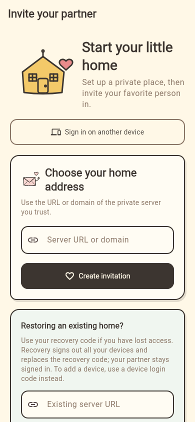
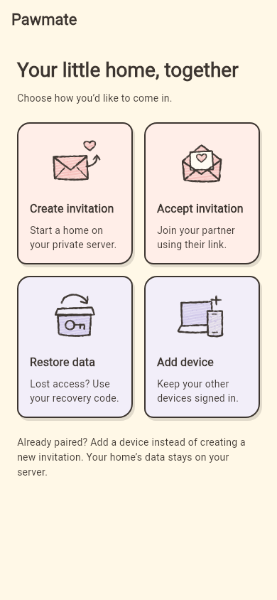
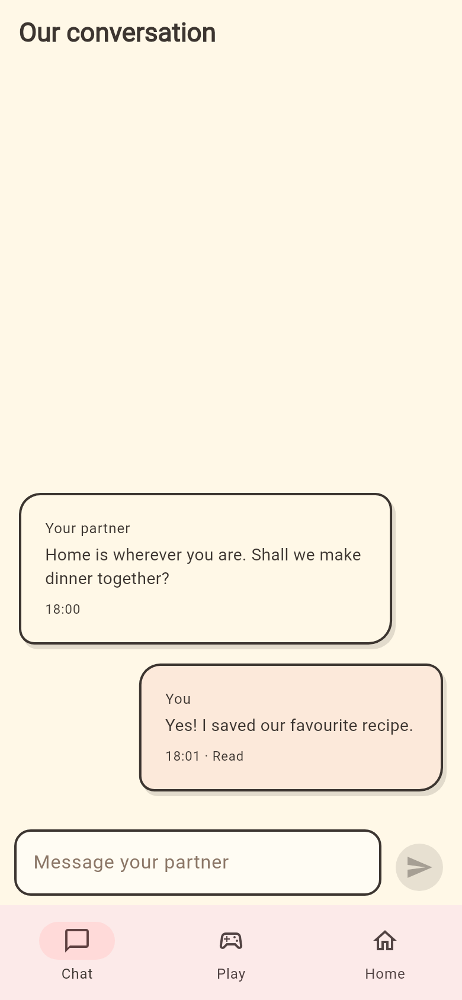

# Current foundation

The repository currently contains two applications:

| Area           | Location        | Current responsibility             |
| -------------- | --------------- | ---------------------------------- |
| Flutter client | repository root | Android-ready Pawmate client shell |
| Gin server     | `server/`       | Private-instance discovery and pairing API |

The Gin server already exposes these unauthenticated discovery endpoints:

```text
GET /healthz
GET /api/v1/instance
```

`GET /api/v1/instance` is the first contract between the client and a private
Pawmate instance. It reports an instance identifier, display name, API version,
public URL when configured, and the currently advertised features.

The Flutter client supports the inviter's server setup, invitation creation,
status checks, accepting a pasted invitation or one opened through the Android
`pawmate://pair` scheme, and restoring a member after reinstall with a recovery
code. On startup, valid paired credentials lead to the couple home, invalid
credentials lead to recovery, and network errors remain retryable. The Gin
service persists the single couple relationship in SQLite and exposes a
session-validation endpoint. Each member can stay signed in on multiple devices,
with an independent access token for each installation. Existing token records
are automatically migrated on server startup.

## Choose an access method

New installations open a **2 × 2 access matrix**, not a long page of unrelated
forms. The four cards are Create invitation, Accept invitation, Restore data,
and Add device. Each opens a focused page with back navigation. An existing
pending invitation still reopens its invitation status page; valid paired
sessions still open Chat, and invalid saved sessions still lead to recovery.

**Accept invitation** lets the invitee paste the complete `pawmate://pair` link.
Clipboard access happens only after pressing Paste link. The client validates
the link, then shows its server address for review; it does not redeem an invite
until the invitee explicitly presses Accept invitation. External links share
the same parser. Do not publish real invitation links in screenshots or logs.

**Restore data** restores account access to data already on the server; it does
not import a backup or copy a database. Recovery rotates credentials and signs
out that member's other devices. **Add device** is the non-destructive choice
when another installation remains signed in.

The icon family lives in `lib/design/icons/access/`, with shared dry-wax rendering
in `crayon_strokes.dart`. Pigment grain, bounded jitter, irregular pressure
overdraw and small broken edges give native paths a warm crayon/oil-pastel feel.
Fixed purpose-based seeds make fresh repaints pixel-stable. Four illustrated
action cards retain native keyboard activation and screen-reader labels. Rows
grow with their text rather than clipping content in a fixed-aspect-ratio grid.

The rest of `lib/design/` is grouped by responsibility: `theme/` contains separate
color and spacing tokens plus the app theme, `layouts/` contains the scaffold,
`components/` contains reusable cards, buttons, fields and message bubbles, and
`illustrations/` contains decorative compositions. Import token files directly;
design widgets do not depend on feature services. See `lib/design/README.md`.

Previous stacked-layout reference (reconstructed from the shared components):



Current two-by-two access landing page (Flutter widget preview, not a device capture):



## Multiple devices and chat

To add a phone, tablet or computer, use **My devices → Add a device** on an
already signed-in device. On the new installation, choose **Sign in on another
device** and enter the same server URL, the one-time device login code, and a
device name. Device login codes expire after ten minutes and do not change the
member's recovery code or sign out existing devices. The home screen also lists
the current member's devices and allows signing out another device. It never
lists or removes the partner's devices.

The couple space now opens on the **Chat** tab, followed by **Play** and **Home**.
The first chat slice supports persisted text messages, earlier history pages,
cross-device synchronization, failed-send retries, read receipts and unread
reminders. Device management and recovery notes live in Home; Play is a placeholder.

Messages use a server sequence ID and a client-generated idempotency ID. Retrying
the same send cannot create a duplicate, even if its first response was lost.
Read progress belongs to a member rather than a device: reading on one of your
devices updates your other devices and the partner's read labels. Only rendered
incoming messages inside the foreground chat viewport advance the read cursor.
Scrolling older history does not acknowledge newer messages outside the viewport.

Foreground synchronization currently polls every two seconds. Chat displays an
unread badge; a message arriving on another tab shows an in-app reminder without
its private content. Background OS push notifications, media, games, recipes and
a durable offline outbox are future work. The input draft and failed sends are
retained across tab switches but not process restarts. Confirmed messages and
read cursors are persisted in SQLite.

The server now accesses SQLite through GORM models, rather than hand-written
CRUD SQL. `server/internal/pairing/models.go` maps the existing tables while
keeping API models independent of storage details. The official GORM SQLite
dialector uses the existing pure-Go `modernc.org/sqlite` connection. Reviewed
additive SQL migrations retain the original constraints and timestamp units;
startup deliberately avoids `AutoMigrate` on an existing private database.
Existing tokens, recovery codes, message IDs and read cursors remain compatible.
Credential rotation, one-time code redemption and message/read upserts keep
explicit transaction boundaries. SQL tracing is disabled for privacy.

The API contracts are `GET /api/v1/chat/messages`, `POST /api/v1/chat/messages`
and `POST /api/v1/chat/read`; see `server/README.md` for pagination, limits and
receipt semantics.

The following widget-rendered preview uses sample messages, not private data:


Recovery codes are single-use and must be saved by each member outside the app.
Recovery revokes all of that member's sessions and outstanding device login codes,
then issues a new token and recovery code; the partner remains signed in. Use
device login codes for normal additional-device sign-in and recovery only when
access has been lost. Newly added devices do not receive recovery secrets.
Production deployments must mount and back up the configured SQLite database
path.
